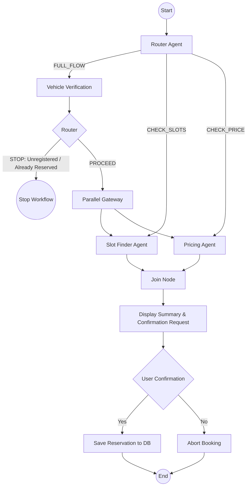

# Parking Reservation Multi-Agent System

A modular multi-agent system, built with **Google ADK 2.0**, that lets employees reserve parking spaces: it verifies vehicle registration details, checks slot availability, calculates charges, and confirms with the employee before saving the reservation.

---

## Tech Stack
- **Python**: 3.12+
- **Agent Framework**: Google ADK 2.0 (`google-adk`)
- **Database**: SQLite (embedded storage)
- **Dependency Manager**: `uv` (recommended)

---

## Project Structure

The project has been refactored into a modular, production-grade directory layout:

```text
parking_reservation_system/
├── pyproject.toml         # UV/Package dependency config
├── .env                   # Local credentials and PYTHONPATH setting
├── README.md              # Documentation
├── sample_prompts.md      # Testing templates
│
├── db/
│   ├── schema.sql         # Database schema
│   └── parking.db         # SQLite database file
│
├── scripts/
│   └── seed_parking_db.py # DB initialization & mock data seeder
│
└── src/
    ├── agent.py           # Root ADK loader entry-point
    │
    └── parking_agent/
        ├── __init__.py    # Exposes agents package
        │
        ├── config/
        │   └── settings.py # Configuration and environment loading
        │
        ├── db/
        │   └── client.py  # SQLite connection factory
        │
        ├── prompts/       # Markdown prompt definitions
        │   ├── router.md
        │   ├── verification.md
        │   ├── slot_finder.md
        │   └── pricing.md
        │
        ├── agents/        # Workflow nodes & sub-agents
        │   ├── utils.py   # Markdown prompt loading helper
        │   ├── router.py
        │   ├── verification.py
        │   ├── slot_finder.py
        │   ├── pricing.py
        │   └── pipeline.py # Core workflow orchestrator (Graph)
        │
        └── tools/         # Database-backed tools used by agents
            ├── __init__.py
            ├── vehicle_tools.py
            ├── slot_tools.py
            ├── price_tools.py
            └── save_tools.py
```

---

## Architecture Flow

The system runs a graph-based workflow featuring conditional branching, parallel processing, and synchronization:



---

## Setup & Running Locally

### 1. Install Dependencies
Run from the project root directory:
```bash
uv sync
```
*Or, using pip:*
```bash
pip install google-adk
```

### 2. Configure Credentials
Copy `.env.example` to `.env` and fill in your Gemini API / Google Cloud Vertex credentials:
```bash
cp .env.example .env
# Edit the .env file with your API credentials
```
> [!IMPORTANT]
> The `.env` file must contain **`PYTHONPATH=src`** so Python knows where to find code packages under the `src/` directory.

### 3. Initialize/Reset Database
Run the seeder script to initialize the SQLite schema and seed mock data (10 employees, 10 vehicles, 18 slots, rate rules):
```bash
python scripts/seed_parking_db.py --reset
```

### 4. Run ADK Dev Server
Start the local server:
```bash
uv run adk web
```
- Open the printed URL (typically `http://127.0.0.1:8000/dev-ui/?app=src`).
- Start conversing with the agent! Refer to `sample_prompts.md` for test scripts.

---

## Deployment to Vertex AI Agent Engine

Once you have verified the agent locally, you can deploy it to Google Cloud Vertex AI Agent Engine:

### 1. Authenticate with Google Cloud
Run the following commands to log in and set up local credentials:
```bash
gcloud auth login
gcloud auth application-default login
```

### 2. Deploy the Agent
Deploy the agent using the ADK deploy workflow. Replace `your-gcp-project-id` with your actual Google Cloud Project ID (e.g. `project-8f12ea6a-1eb5-4330-a3b`):
```bash
uv run adk deploy agent_engine src --project your-gcp-project-id --region us-central1
```
